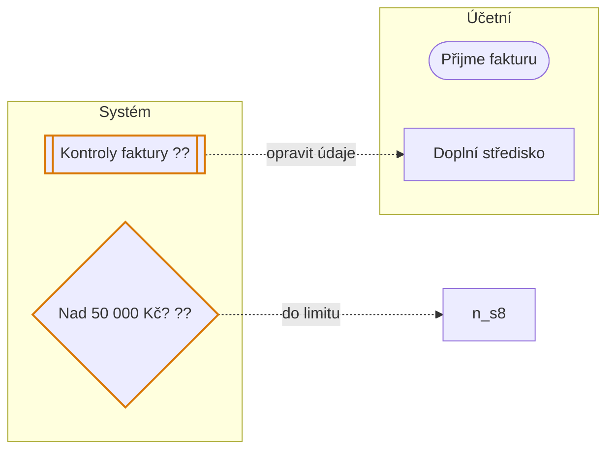
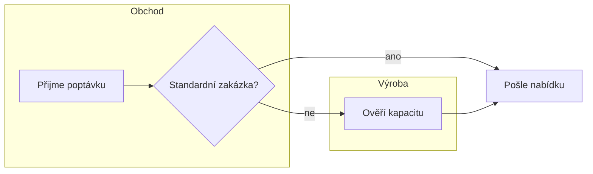
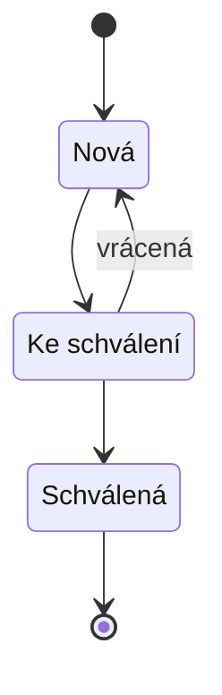
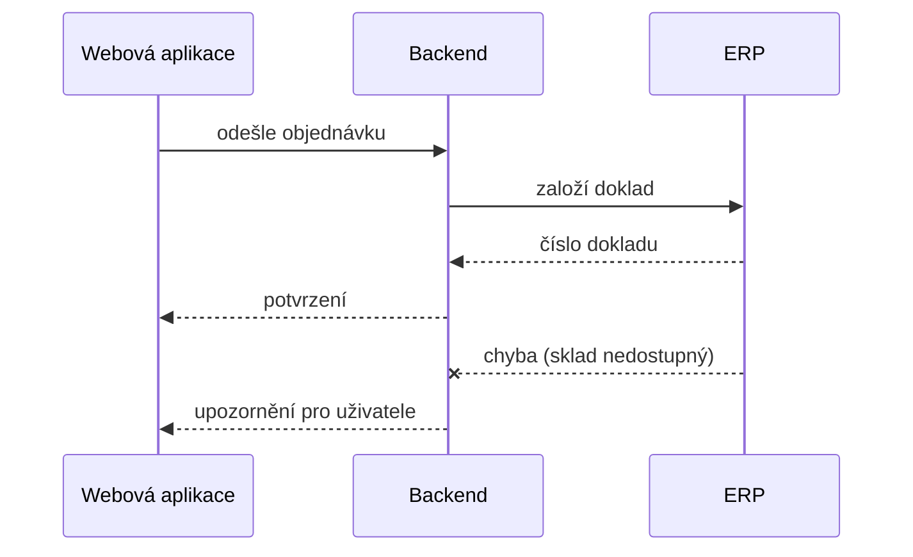

# Mermaid

Mermaid je nejrychlejší výstup: žije přímo v markdownu, GitHub ho vykreslí a nepotřebuje žádný nástroj. Animaci ani přesné rozložení nemá; pruhy rolí jsou jen přibližné (`subgraph`).

## Co generuje pmap.py

`pmap.py mermaid "<spec>"` vyrobí `<proces>.mermaid.md` se třemi částmi: tok s pruhy rolí, diagram stavů a seznam otevřených a vyřešených otázek. Zkrácená ukázka ze vzoru:

- **Tvary uzlů podle typu kroku:** úloha `["…"]`, rozhodnutí `{"…"}`, start a konec `(["…"])`, kontroly `[["…"]]`, průběžná role `[/"…"/]`.
- **Šipky:** smyčka a alternativa jsou čárkované `-.->`.
- **Otázky** `??` mají jemný oranžový rámeček (třída `q`). Je to jediné barevné značení. Jinak výstup drží konvence `client-delivery:client-discovery` (popisky v `["…"]`, rozhodnutí jako otázka, bez dalšího stylování).
- **Směr je `LR`** (zleva doprava) kvůli shodě s HTML výkresem; `client-discovery` používá `TD`. Pro dlouhý úzký proces v dokumentaci můžeš `LR` ručně přepsat na `TD`.
- **Speciální znaky** (`"`, `<`, `>`, `&`, `#`) se zapisují jako entity Mermaid (`#quot;`, `#lt;`, `#gt;`, `#amp;`, `#35;`), takže se zobrazí doslova.

## Ruční vzory

Tok s pruhy rolí (když nestačí generovaný, třeba pro složité větvení):

Stavy objektu:

Komunikace mezi systémy (sekvenční diagram; plugin ho negeneruje, piš ručně):

## Ověření

- Lokálně: `npx -y @mermaid-js/mermaid-cli@12.0.0 -i "<proces>.mermaid.md" -o "<proces>.svg"`. Verze je připnutá. První běh stahuje prohlížeč a trvá několik minut, spouštěj ho s delším časovým limitem nebo na pozadí.
- Klientské diagramy nevkládej do mermaid.live ani do jiných online editorů se sdílením přes odkaz: diagram je zakódovaný přímo v URL.
